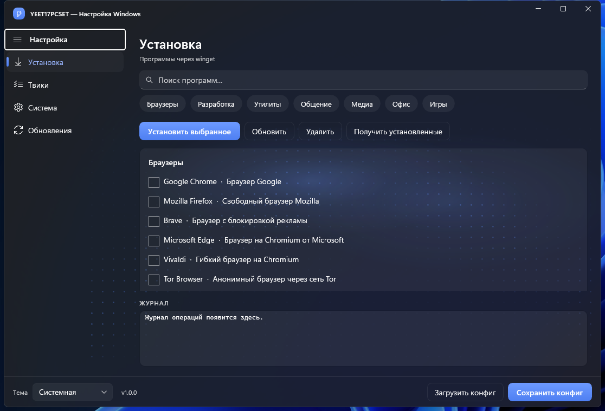
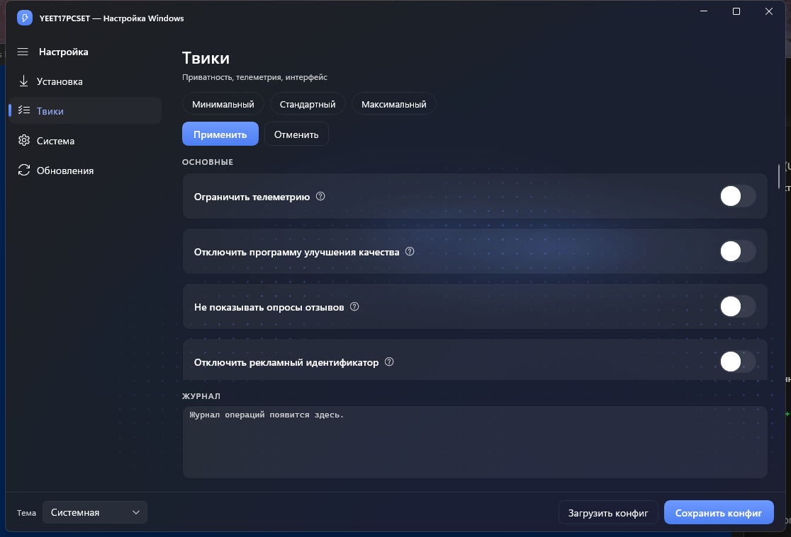
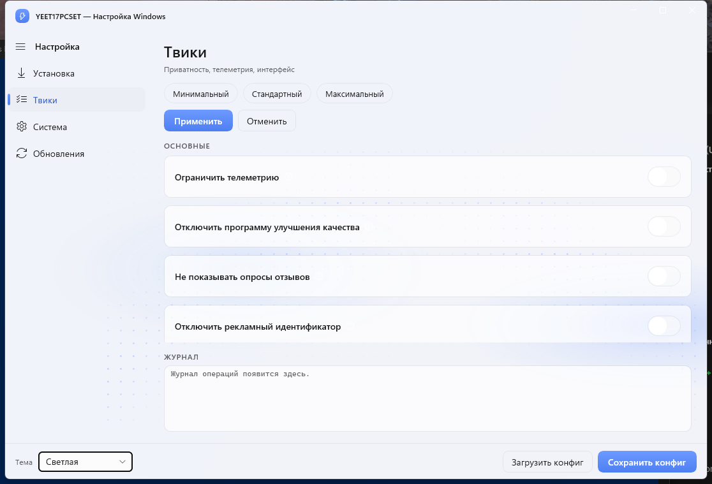

<div align="center">


# YEET17PCSET

**Нативная утилита пост-установочной настройки Windows.**
C++23 · WinUI 3 · Mica · без Electron, без WebView, без скриптов в фоне.

[](https://github.com/scarrymany/YEET17PCSET/releases/latest)
[](LICENSE)




</div>

---

## Возможности

- **Установка** — каталог программ через winget: поиск, категории, установка, обновление и удаление пачкой, живой журнал операций.
- **Твики** — приватность, телеметрия и интерфейс: пресеты (минимальный / стандартный / максимальный), подтверждение опасных твиков, отмена, точка восстановления.
- **Система** — компоненты Windows через DISM, ремонт (SFC + DISM, сброс сети и Windows Update, восстановление winget), запуск классических оснасток.
- **Обновления** — четыре официальных режима политики Windows Update, без отключения служб.
- **Автообновление приложения** — проверка GitHub Releases при старте; кнопка в футере скачивает релиз и обновляет установку с автоперезапуском.
- **Дизайн** — Fluent + акценты в духе Telegram Desktop: Mica/Acrylic, анимированный фон-«пиксельная арка» (нативный Composition-аналог Predictive Arc), плавные переходы страниц, тёмная и светлая темы.

| Твики | Светлая тема |
|---|---|
|  |  |

## Установка

Одной командой в PowerShell:

```powershell
irm https://scarrymany.github.io/YEET17PCSET/install.ps1 | iex
```

Скрипт скачивает свежий релиз и ставит MSI (Program Files, ярлык в «Пуске», корректное удаление через «Программы и компоненты»). Запасная команда, если Pages недоступен:

```powershell
irm https://raw.githubusercontent.com/scarrymany/YEET17PCSET/main/docs/install.ps1 | iex
```

Вручную — на [странице релизов](https://github.com/scarrymany/YEET17PCSET/releases/latest): `YEET17PCSET-win-x64.msi` (инсталлер) или `YEET17PCSET-win-x64.zip` (портативно: распаковать и запустить `YEET17PCSET.exe`). Нужен установленный Windows App Runtime 1.6. Дальше приложение обновляется само.

---

**YEET17PCSET / YEET17 Настройка ПК** — нативное приложение для пост-установки Windows.

Окно: **YEET17PCSET — Настройка Windows**. Язык интерфейса — только русский. Целевые ОС: Windows 10 22H2+ и Windows 11 (x64 основной, ARM64 в CMake).

Это легитимный инструмент настройки (в духе Chris Titus WinUtil, но на C++ / WinUI 3): приватность, телеметрия, установка пакетов через winget CLI, твики реестра/служб, DISM-компоненты, политика Windows Update. У твиков есть отмена и (если включена защита системы) точка восстановления. Никакой вредоносной логики, скрытой персистентности, кражи учётных данных или скрытого удалённого управления. Защитник, UAC и брандмауэр приложение не отключает.

## Стек

| Компонент | Выбор |
|---|---|
| Язык | C++23 |
| UI | WinUI 3 (C++/WinRT), Windows App SDK 1.6 (NuGet, не поддельный CMake-таргет) |
| Сборка | CMake 3.25+ + vcpkg (манифест) |
| JSON | nlohmann/json |
| Логи | spdlog → `%LOCALAPPDATA%\YEET17PCSET\logs` |
| Упаковка | Unpackaged `YEET17PCSET.exe`, `requireAdministrator` (UAC при запуске) |
| Фон | Mica на Windows 11, Acrylic на Windows 10 |

## Что нужно на машине разработчика

1. **Windows 10 22H2 / Windows 11.** Собрать WinUI 3 на Linux **нельзя** — исходники читаются (`#ifdef _WIN32`), линковки exe нет.
2. **Visual Studio 2022** (17.8+) с нагрузками:
   - Разработка классических приложений на C++
   - Универсальная платформа Windows (Windows App SDK / C++/WinRT)
   - Windows 11 SDK **10.0.22621.0** или новее
3. **Windows App SDK** 1.5+ (Visual Studio Installer → отдельные компоненты). CMake также тянет NuGet `Microsoft.WindowsAppSDK_1.6.*` и `Microsoft.Windows.CppWinRT` через `VS_PACKAGE_REFERENCES`.
4. **CMake 3.25+** и **Ninja** (или генератор «Visual Studio 17 2022»).
5. **vcpkg** и `VCPKG_ROOT` (манифест `vcpkg.json`: `nlohmann-json`, `spdlog`).
6. **winget** в PATH (клиент «Установщик приложений») — страница «Установка».
7. **Защита системы (System Restore) включена**, иначе точка восстановления перед пакетом твиков не создастся. Это не ошибка приложения.

## Сборка

Откройте «x64 Native Tools Command Prompt for VS 2022» (или ARM64-аналог) и перейдите в корень распакованного дерева.

Пресеты CMake работают **только на Windows** (`condition: hostSystemName == Windows`).

### Ninja, x64, Debug

```bat
cmake --preset x64-debug
cmake --build --preset x64-debug
```

Результат: `build\x64-debug\YEET17PCSET.exe`

### Ninja, x64, Release

```bat
cmake --preset x64-release
cmake --build --preset x64-release
```

Результат: `build\x64-release\YEET17PCSET.exe`

### Ninja, ARM64

```bat
cmake --preset arm64-release
cmake --build --preset arm64-release
```

### Visual Studio 2022 (решение)

```bat
cmake --preset vs2022-x64
cmake --build --preset vs2022-x64-release
```

Или откройте `build\vs2022-x64\YEET17PCSET.sln` и соберите Debug / Release. Exe: `build\vs2022-x64\Release\YEET17PCSET.exe`.

### Если CMake не находит заголовки Windows App SDK

Это не поддельный imported-таргет. На Windows линковка идёт на системный `WindowsApp` + NuGet из `VS_PACKAGE_REFERENCES`. Если генератор VS не восстановил пакеты:

```bat
cmake --preset vs2022-x64
```

затем в Visual Studio восстановите NuGet, либо укажите `-DWindowsAppSDK_DIR=...` на каталог с `winrt/Microsoft.UI.Xaml.h`.

После сборки рядом с `YEET17PCSET.exe` копируются `catalog\`, `presets\` и `resources\`. Запускайте exe из этой папки.

## Запуск

Исполняемый файл **обязан** называться `YEET17PCSET.exe`. Манифест запрашивает `requireAdministrator`. Если процесс всё же без прав, `Elevation` делает `ShellExecuteW(..., L"runas", ...)`.

Тема (система / тёмная / светлая) — источник истины `%LOCALAPPDATA%\YEET17PCSET\settings.json` (`ThemeService` + `core::Settings`). Экспорт конфига тему не подменяет. Логи: `%LOCALAPPDATA%\YEET17PCSET\logs\yeet17.log`.

## Что работает

- **Установка** — `catalog\packages.json` (33 пакета, в том числе `PeterPawlowski.foobar2000`), поиск, категории, `WingetClient::RunBulk` / `PackageJob` (CLI `winget.exe`, успех только при коде выхода 0).
- **Твики** — 30 id из `catalog\tweaks.json`. Пресеты: minimal 9 / standard 16 essential / maximal 25 (без confirm). Применение через `TweakEngine::ApplyEnabled`, опасные id — ContentDialog. Отмена по снимку. Точка восстановления, если защита системы включена.
- **Система** — DISM-компоненты (`Features`), ремонт сети / WU / SFC+DISM / winget (`Repairs`), классические оснастки (`LegacyPanels`). Отключение компонента — диалог подтверждения, без тихого DISM.
- **Обновления** — `UpdatePolicy`: все / только безопасность / пауза / сброс к умолчанию. `wuauserv` не стопается.
- **Конфиг** — сохранить/загрузить через `ConfigStore` (schemaVersion 1, app YEET17PCSET, tweaks как объект id→bool).

## Честные пробелы (не баги «потом допишем втихую»)

- **COM winget (Microsoft.Management.Deployment) не реализован.** В `WingetClient.h` есть заглушка `WingetComClient` и TODO(com). Сейчас только CLI. Нельзя сообщать об успехе без exit code == 0.
- **Сборка на Linux невозможна.** CMake на Linux выдаст WARNING и не соберёт exe. Распакуйте дерево на машине с VS 2022.
- **Точка восстановления требует включённой защиты системы.** Если System Restore выключен, `SRSetRestorePointW` вернёт ошибку; твики при этом всё равно можно применить (в логе будет предупреждение).
- **Ninja без Visual Studio XAML compiler** не сгенерирует `*.xaml.g.h`. Для UI надёжнее пресет `vs2022-x64` или сборка из `.sln`.
- Загрузка конфига **не** гоняет DISM по списку компонентов молча: переключатели на странице «Система» остаются живым состоянием машины, отключение — только после диалога.

## Лицензия

MIT. Используйте только на своих машинах или с явного согласия владельца.
